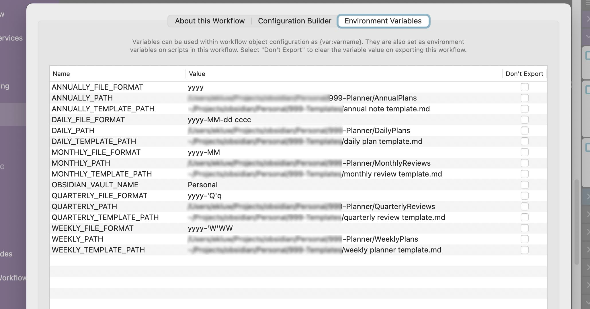

# alfred-chrono-notes [](https://github.com/weklund/alfred-chrono-notes/actions/workflows/tests.yml) [](https://coveralls.io/github/weklund/alfred-chrono-notes) 

Alfred Workflow for easy access to your Obsidian Periodic Notes.

## Getting Started

### Requirements

1. [node>=13](https://nodejs.org/en/download)
1. [npm>=6.12](https://docs.npmjs.com/downloading-and-installing-node-js-and-npm)
1. [Obsidian](https://obsidian.md/)
1. [Periodic Notes Plugin(Optional)](https://github.com/liamcain/obsidian-periodic-notes)

### Setup

#### Install
```sh
npm install alfred-chrono-notes
```

#### Configure
Current onboarding is painful, a better config onboarding is coming soon!

For now, users will onboard their ChronoNote Types by adding environment variables for each Interval:

- FILE_FORMAT
- PATH
- TEMPLATE_PATH

If you are a user of [Obsidian Periodic Notes](https://github.com/liamcain/obsidian-periodic-notes), these should be familiar to you already.

Each of these environment variables will be prefixed by the Interval.  For example:

Environment Variable Name:
- `DAILY_FILE_FORMAT`: 'yyyy'
- `DAILY_PATH`: '~/my-obsidian/my-vault/my-daily-folder'
- `DAILY_TEMPLATE_PATH`: '~/my-obsidian/my-vault/my-daily-folder'



### Usage


## How Alfred Chrono Notes works

### What makes up a Chrono Note?

#### Intervals

- Daily
- Weekly
- Monthly
- Quarterly
- Annually

#### Ordinal

- Current
- Next
- Previous

### Date Format Tokens

https://moment.github.io/luxon/#/formatting?id=table-of-tokens

### Testing

There are unit tests, but there currently isn't a way to an integrate test with an alfred environment. All PRs need to have a screenshot or gif of it working
